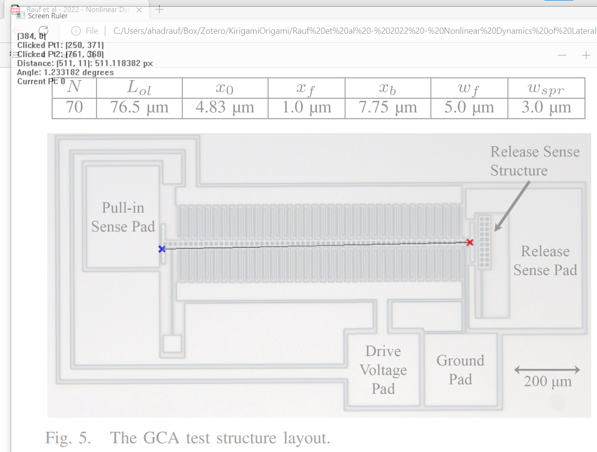

# Screen Ruler for Windows
A simple program to find the distances and angles between points on a Windows screen. No bloatware, and easy to use. It helps immensely with quickly extracting numerical data and dimensions from scientific papers, although definitely not meant to be a replacement for much more robust (and correspondingly more time intensive) tools like Adobe Illustrator or [WebPlotDigitizer](https://automeris.io/WebPlotDigitizer/).

Includes an .exe file for easy usage, or feel free to read the code and compile yourself! Compile using the arguments ``-mwindows`` and ``-lgdiplus`` (note that the last command needs to go after the ``-o FILE_NAME`` argument for some reason).

You can also link this to a Windows shortcut (I personally use Ctrl + Shift + M) by right-clicking the .exe file > Properties > Shortcut > enter your desired shortcut (pictoral instructions [here](https://www.laptopmag.com/articles/create-keyboard-shortcuts-windows-10)).

## Demonstration
Once you launch the program, it'll open up a semi-transparent window over your current screen. An overlay in the top left shows your current mouse position, and clicking on the screen will log points. Once two points are logged, the distance and angle between the previous two points will be displayed.

|  |
|:--:|
| Demonstration using Screen Ruler for Windows. Image taken from A. M. Rauf, D. S. Contreras, R. M. Shih, C. B. Schindler, and K. S. J. Pister, "Nonlinear Dynamics of Lateral Electrostatic Gap Closing Actuators for Applications in Inchworm Motors," Journal of Microelectromechanical Systems, vol. 31, no. 1, pp. 29–36, Feb. 2022, doi: [10.1109/JMEMS.2021.3130957](http://doi.org/10.1109/JMEMS.2021.3130957).|
